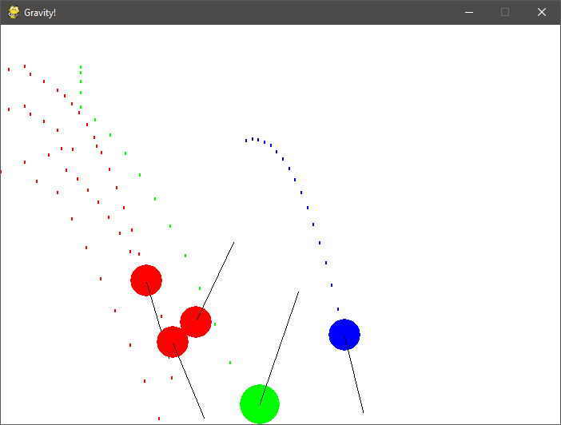

# GravityBalls

 

A funny small project that consists in animating balls with gravity and in handling balls' collision.

**TODO List**
- [x] Basic gravity
- [x] Collision between balls
- [x] Move any the ball with mouse
- [x] Points behind the balls
- [ ] Lines behind the balls
- [ ] ! Improve collision
- [ ] Automatic velocity reducer according to friction

## 1. Getting started
### 1.1 Prerequisites
- pygame
- python 3

### 1.2 How to use it
Execute main.py.

### 1.3 Setting up your dev environment
Run `pip install -r requirements.txt`. Then, use your favorite code editor, and start coding :D

## 2. Miscellaneous
### 2.1 Changelog
The changelog is available [here](CHANGELOG.md).

### 2.2 Authors
- **N3ROO** - *Initial work* - [Github](https://github.com/N3ROO) [Website](https://n3roo.github.io/)

### 2.3 License
This project is licensed under the <licensename> license - see the [LICENSE](LICENSE) file for details